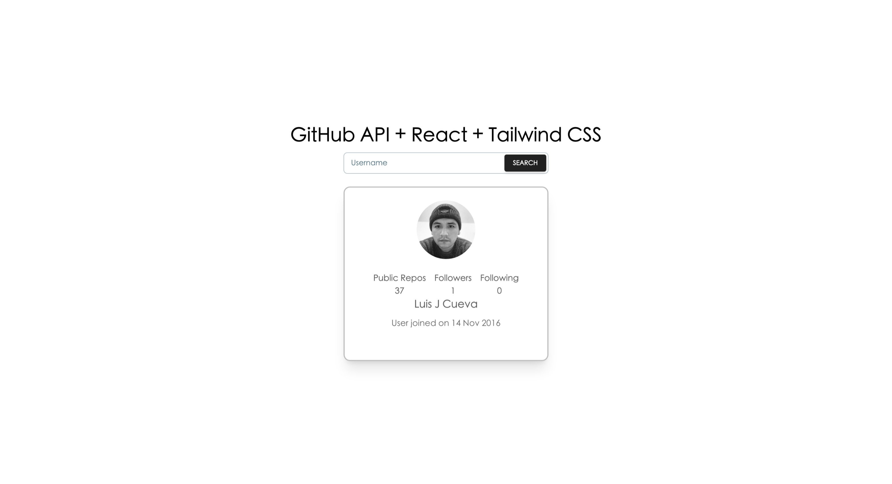

# GitHub Explorer

[](https://reactjs.org/)
[](https://vitejs.dev/)
[](https://tailwindcss.com/)

Minimalist application to search and display GitHub profiles, built with Clean Architecture principles.



---

## 🚀 Quick Start

```bash
# Install dependencies
pnpm install

# Development
pnpm run dev

# Build
pnpm run build

# Deploy
pnpm run deploy
```

---

## ✨ Features

✅ Search for GitHub users
✅ View full profile
✅ Automatic dark mode
✅ Responsive design
✅ Smooth animations

---

## 🏗️ Architecture

This project follows the principles of **Clean Architecture**, separating concerns into distinct layers. This makes the codebase modular, scalable, and easy to maintain.

```
src/
├── presentation/     # UI Layer (React Components, Hooks, Pages)
├── application/      # Application Layer (Use Cases)
├── domain/           # Domain Layer (Entities, Business Rules)
└── infrastructure/   # Infrastructure Layer (API Services, External Libraries)
```

For a more detailed explanation of the architecture and design patterns used, see the [Final Analysis](./src/docs/FINAL_ANALYSIS.md).

---

## 💻 Tech Stack

- **React 18.3** - UI Library
- **Vite 5.4** - Build Tool
- **Tailwind CSS 3.4** - Styling
- **React Context** - State Management
- **Google Fonts** - Lora & Macondo
- **React Icons** - Icons

---

## 📚 Documentation

See [DOCUMENTATION.md](./src/docs/DOCUMENTATION.md) for complete documentation.

**Other documents:**
- [Final Analysis](./src/docs/FINAL_ANALYSIS.md)
- [Migration Plan](./src/docs/MIGRATION_PLAN.md)
- [UX/UI Analysis](./src/docs/UX_UI_ANALYSIS.md)

---

## 📊 Metrics

- **JS Bundle**: 159 KB (51 KB gzip)
- **CSS Bundle**: 15 KB (3.5 KB gzip)
- **Lighthouse**: 95+
- **0 ESLint Errors**

---

## 🤝 Contributing

1. Fork the project
2. Create your feature branch
3. Commit your changes
4. Push to the branch
5. Open a Pull Request

---

## 📄 License

MIT License - See [LICENSE](./LICENSE) for more details.

---

**Developed with ❤️ using React + Vite + Tailwind CSS**