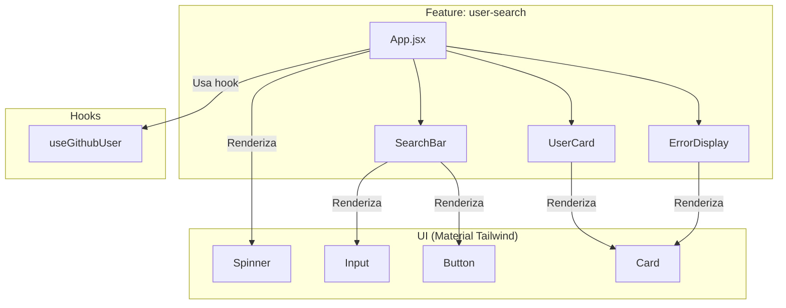

# Documento Técnico de Arquitectura: Visor de Perfiles de GitHub

## 1. Casos de Uso Principales

-   **CU-01: Búsqueda de un usuario de GitHub**: Un usuario introduce un nombre de usuario en una barra de búsqueda y pulsa "Buscar" o la tecla Enter. El sistema recupera y muestra la información del perfil de ese usuario si existe.
-   **CU-02: Visualización de información del perfil**: Tras una búsqueda exitosa, el sistema muestra el avatar del usuario, su nombre, nombre de usuario, fecha de ingreso y estadísticas (repositorios públicos, seguidores, seguidos).
-   **CU-03: Manejo de usuario no encontrado**: Si el usuario buscado no existe, el sistema muestra un mensaje de error claro indicando que el usuario no fue encontrado.
-   **CU-04: Manejo de errores de API**: Si hay un problema de comunicación con la API de GitHub (ej. límite de tasa excedido), el sistema muestra un mensaje de error apropiado.

## 2. Requerimientos

### Funcionales

-   **RF-01**: La aplicación DEBE tener un campo de texto para que el usuario ingrese un nombre de usuario de GitHub.
-   **RF-02**: La aplicación DEBE tener un botón para iniciar la búsqueda.
-   **RF-03**: La aplicación DEBE realizar una petición a la API de GitHub (`https://api.github.com/users/{username}`) para obtener los datos.
-   **RF-04**: La aplicación DEBE mostrar un indicador de carga mientras se espera la respuesta de la API.
-   **RF-05**: Si el usuario es encontrado, la aplicación DEBE mostrar, como mínimo: avatar, nombre, nombre de usuario, fecha de alta, número de repositorios públicos, seguidores y seguidos.
-   **RF-06**: Si el usuario no es encontrado, la aplicación DEBE mostrar un mensaje de error claro.
-   **RF-07**: La aplicación DEBE cargar un perfil de usuario por defecto al iniciar.

### No Funcionales

-   **RNF-01 (Rendimiento)**: La respuesta visual a una búsqueda debe ser rápida. El estado de carga no debería superar los 3 segundos en una conexión de red promedio.
-   **RNF-02 (Usabilidad)**: La interfaz debe ser intuitiva y auto-explicativa.
-   **RNF-03 (Mantenibilidad)**: El código debe estar bien estructurado, documentado y seguir principios de diseño que faciliten su modificación y extensión.
-   **RNF-04 (Compatibilidad)**: La aplicación debe funcionar correctamente en las últimas dos versiones de los navegadores modernos (Chrome, Firefox, Safari, Edge).

## 3. Diagrama de Flujo del Proceso de Búsqueda

Este diagrama ilustra el flujo lógico desde que el usuario inicia una búsqueda hasta que ve un resultado.

```mermaid
graph TD
    A[Inicio] --> B{Usuario introduce username y pulsa buscar};
    B --> C[searchUser(username) es llamado];
    C --> D{isLoading = true, error = null};
    D --> E[Llamada a servicio fetchUser(username)];
    E --> F{¿Respuesta de API exitosa?};
    F -- Sí --> G[setUser(data)];
    F -- No --> H[setError(error.message)];
    G --> I{isLoading = false};
    H --> I;
    I --> J[Renderizado condicional en UI];
    J -- isLoading --> K[Muestra Spinner];
    J -- error --> L[Muestra ErrorDisplay];
    J -- user --> M[Muestra UserCard];
```

## 4. Diagrama de Componentes

Este diagrama muestra la relación y jerarquía entre los principales componentes de React.



## 5. Arquitectura Lógica y Flujo de Datos

La arquitectura sigue un patrón de flujo de datos unidireccional, típico en React.

1.  **Capa de Vista (Componentes)**: `App.jsx` actúa como el componente contenedor principal. Renderiza componentes de presentación como `SearchBar`, `UserCard` y `ErrorDisplay`. La vista no conoce la lógica de negocio; solo invoca funciones (ej: `searchUser`) y renderiza datos que recibe como props o del hook.

2.  **Capa de Estado/Lógica de UI (Hooks)**: El hook `useGithubUser` es el corazón de la lógica de la aplicación. Contiene el estado (`user`, `isLoading`, `error`) y la función `searchUser` que orquesta la llamada a la API y las actualizaciones de estado. Actúa como un *ViewModel* o *Presenter* que conecta la Vista con la lógica de negocio.

3.  **Capa de Servicios (API)**: El archivo `services/github.js` abstrae los detalles de la comunicación con la API de GitHub. Su función `fetchUser` es responsable de construir la URL, realizar la petición `fetch`, y manejar las respuestas HTTP (éxito o error), devolviendo los datos o lanzando una excepción.

**Flujo de Datos:**

```
(1. Evento de UI)          (2. Invocación)         (3. Llamada API)           (4. Respuesta)         (5. Actualización de Estado)         (6. Nuevo Renderizado)
SearchBar           -->    useGithubUser.searchUser() -->    github.service.fetchUser() -->    (data | error)    -->    useGithubUser (setState)    -->    Componentes (reciben nuevo estado)
```

## 6. Representación del Estado

El estado de la aplicación está centralizado y gestionado dentro del hook `useGithubUser`.

```javascript
// Estado dentro de useGithubUser.js
{
  user: null | object,  // Almacena los datos del usuario si la búsqueda es exitosa.
  isLoading: boolean,   // true mientras se espera la respuesta de la API.
  error: null | string  // Almacena el mensaje de error si una petición falla.
}
```

Este enfoque simple es eficaz para el alcance actual. Si la aplicación creciera y necesitara compartir estado entre diferentes *features*, se podría considerar:
-   **React Context**: Para compartir el estado del hook a un árbol de componentes más profundo.
-   **Zustand/Redux**: Para una gestión de estado global más compleja y desacoplada.

## 7. Riesgos y Mitigaciones

| Riesgo | Probabilidad | Impacto | Mitigación |
| :--- | :--- | :--- | :--- |
| **Límite de Tasa de la API de GitHub** | Alta (para IPs compartidas) | Alto (la app deja de funcionar) | 1. **Actual**: Se muestra un error claro al usuario. <br> 2. **Futuro**: Implementar autenticación OAuth con GitHub para usar el límite de tasa del usuario autenticado (mucho mayor). |
| **Cambios en la API de GitHub** | Baja | Medio | La lógica de API está aislada en la capa de servicios. Si la API cambia, solo se necesita modificar `services/github.js`. |
| **Crecimiento Incontrolado de `App.jsx`** | Baja (post-refactorización) | Alto | La arquitectura basada en features y hooks previene que `App.jsx` vuelva a ser monolítico. Nuevas funcionalidades deben crearse en sus propios módulos. |

## 8. APIs Utilizadas

-   **GitHub REST API**:
    -   **Endpoint**: `GET https://api.github.com/users/:username`
    -   **Descripción**: Recupera la información del perfil público para un usuario específico.
    -   **Documentación Oficial**: [https://docs.github.com/es/rest/users/users#get-a-user](https://docs.github.com/es/rest/users/users#get-a-user)
```
