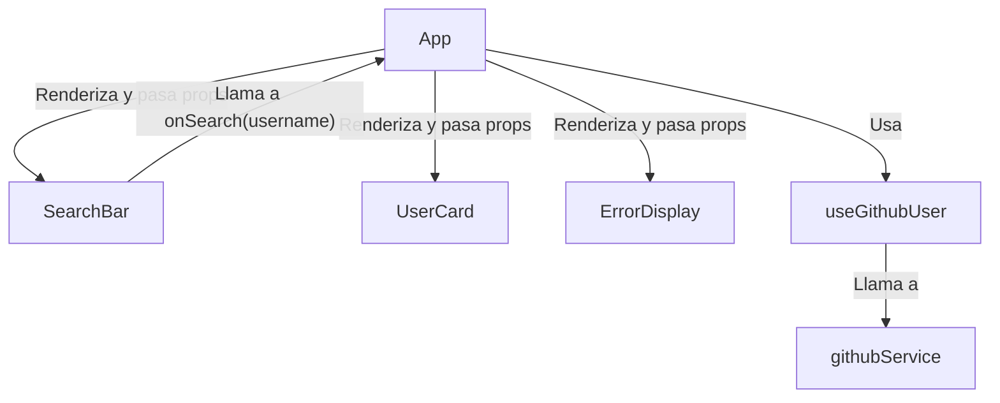

# Tutorial Completo: Creando un Visor de Perfiles de GitHub con React

¡Bienvenido! En este tutorial, construiremos paso a paso una aplicación moderna de React para buscar y mostrar perfiles de usuario de GitHub. Aprenderás no solo a construir la aplicación, sino también a estructurarla de manera profesional y escalable.

## 🎯 Objetivo Final

Crearemos una aplicación donde puedes escribir un nombre de usuario de GitHub, presionar "Buscar" y ver una tarjeta con la información de ese perfil.


## 🛠️ Requisitos Previos

-   Conocimientos básicos de HTML, CSS y JavaScript (ES6+).
-   Conocimientos fundamentales de React (componentes, props, state, hooks).
-   Tener [Node.js](https://nodejs.org/) (v18 o superior) instalado.

---

### **Paso 1: Inicializando el Proyecto con Vite**

Vite es una herramienta de construcción moderna que nos da un entorno de desarrollo increíblemente rápido.

```bash
# Crea un nuevo proyecto de React con Vite
npm create vite@latest my-github-viewer -- --template react

# Entra en el directorio del proyecto
cd my-github-viewer

# Instala las dependencias iniciales
npm install
```

### **Paso 2: Instalando Dependencias Clave**

Necesitaremos algunas librerías para construir nuestra UI y manejar los estilos.

-   **Tailwind CSS**: Para un diseño rápido y moderno basado en utilidades.
-   **@material-tailwind/react**: Una librería de componentes que funciona genial con Tailwind.

```bash
# Instalar Tailwind CSS y sus dependencias
npm install -D tailwindcss postcss autoprefixer

# Inicializar Tailwind CSS (crea los archivos de configuración)
npx tailwindcss init -p

# Instalar Material Tailwind
npm install @material-tailwind/react
```

Ahora, configuremos Tailwind para que funcione con nuestro proyecto.

1.  **`tailwind.config.js`**:
    ```javascript
    const withMT = require("@material-tailwind/react/utils/withMT");

    module.exports = withMT({
      content: ["./index.html", "./src/**/*.{js,jsx,ts,tsx}"],
      theme: {
        extend: {},
      },
      plugins: [],
    });
    ```

2.  **`src/index.css`**: Reemplaza el contenido del archivo con las directivas de Tailwind.
    ```css
    @tailwind base;
    @tailwind components;
    @tailwind utilities;
    ```

### **Paso 3: Definiendo la Arquitectura de Carpetas**

Antes de escribir código, creemos una estructura de carpetas que nos permita crecer de forma ordenada.

Dentro de la carpeta `src/`, crea las siguientes carpetas:
-   `/features`: Para agrupar código por funcionalidad.
-   `/services`: Para la lógica que interactúa con APIs externas.
-   `/utils`: Para funciones auxiliares y reutilizables.

Y dentro de `/features`, crea `user-search` con sus propias carpetas `components` y `hooks`. ¡Ya tenemos nuestro esqueleto!

```
/src
├── /features
│   └── /user-search
│       ├── /components
│       └── /hooks
├── /services
└── /utils
```

### **Paso 4: La Capa de Servicio (Comunicación con la API)**

Vamos a aislar la lógica de `fetch`. Esto hace que nuestro código sea más fácil de probar y mantener.

Crea el archivo `src/services/github.js`:

```javascript
/**
 * @file Contiene la lógica para interactuar con la API de GitHub.
 */
const API_BASE_URL = "https://api.github.com";

export const fetchUser = async (username) => {
    if (!username) throw new Error("El nombre de usuario no puede estar vacío.");

    const response = await fetch(`${API_BASE_URL}/users/${username}`);

    if (response.status === 404) throw new Error("Usuario no encontrado.");
    if (response.status === 403) throw new Error("Límite de tasa de la API excedido.");
    if (!response.ok) throw new Error("Error en la API de GitHub.");

    return await response.json();
};
```
**✨ Buena Práctica:** Aislar las llamadas a la API en una capa de servicios es un pilar de la **Clean Architecture**. Los componentes no deben saber *cómo* se obtienen los datos, solo deben pedirlos.

### **Paso 5: El Hook Personalizado (El Cerebro de la App)**

Este es el paso más importante. Crearemos un hook que maneje toda la lógica de estado: cuándo estamos cargando, si hay un error, y cuáles son los datos del usuario.

Crea el archivo `src/features/user-search/hooks/useGithubUser.js`:

```javascript
import { useState, useCallback } from "react";
import { fetchUser } from "../../../services/github";

export const useGithubUser = () => {
    const [user, setUser] = useState(null);
    const [isLoading, setIsLoading] = useState(false);
    const [error, setError] = useState(null);

    const searchUser = useCallback(async (username) => {
        setIsLoading(true);
        setError(null);
        setUser(null); // Limpiar búsqueda anterior

        try {
            const userData = await fetchUser(username);
            setUser(userData);
        } catch (e) {
            setError(e.message);
        } finally {
            setIsLoading(false);
        }
    }, []);

    return { user, isLoading, error, searchUser };
};
```
**✨ Buena Práctica:** Abstraer la lógica compleja de estado en hooks personalizados es una de las características más potentes de React. Esto hace que nuestros componentes sean mucho más limpios y declarativos.

### **Paso 6: Creando los Componentes de la Interfaz**

Ahora, construyamos los bloques de nuestra UI.

1.  **`src/features/user-search/components/SearchBar.jsx`**: El campo de búsqueda y el botón.
    ```javascript
    // ... (código del componente SearchBar ya generado)
    // Nota: El SearchBar recibe onSearch, isLoading y hasError como props.
    // Es un "componente controlado" por su padre, pero gestiona su
    // propio estado interno para el texto del input.
    ```

2.  **`src/features/user-search/components/UserCard.jsx`**: La tarjeta que muestra los datos.
    ```javascript
    // ... (código del componente UserCard ya generado)
    // Nota: Este es un "componente de presentación". Recibe el objeto `user`
    // y solo se encarga de mostrarlo de forma bonita. No tiene lógica de negocio.
    ```

3.  **`src/features/user-search/components/ErrorDisplay.jsx`**: El mensaje de error.
    ```javascript
    // ... (código del componente ErrorDisplay ya generado)
    // Se especializa en mostrar errores de una manera visualmente clara.
    ```

### **Paso 7: Ensamblando Todo en `App.jsx`**

Ahora que tenemos todas las piezas, `App.jsx` se vuelve sorprendentemente simple. Su único trabajo es usar nuestro hook y decidir qué componente mostrar en función del estado.

Limpia `src/App.jsx` y reemplázalo con esto:

```javascript
import React, { useEffect } from "react";
import { Spinner, Typography } from "@material-tailwind/react";
import { useGithubUser } from "./features/user-search/hooks/useGithubUser";
import SearchBar from "./features/user-search/components/SearchBar";
import UserCard from "./features/user-search/components/UserCard";
import ErrorDisplay from "./features/user-search/components/ErrorDisplay";

const App = () => {
    const { user, isLoading, error, searchUser } = useGithubUser();

    // Cargar un usuario por defecto al iniciar
    useEffect(() => {
        searchUser("slinkter");
    }, [searchUser]); // El array de dependencias es importante

    return (
        <div className="min-h-dvh w-full bg-gray-50 flex flex-col justify-center items-center p-4">
            <header className="text-center mb-8">
                {/* ... Títulos ... */}
            </header>

            <main className="w-full max-w-md">
                <SearchBar onSearch={searchUser} isLoading={isLoading} hasError={!!error} />
                <div className="mt-8">
                    {isLoading && <Spinner />}
                    {error && <ErrorDisplay error={error} />}
                    {!isLoading && !error && user && <UserCard user={user} />}
                </div>
            </main>
        </div>
    );
};

export default App;
```

**✨ Diagrama de Flujo de la Aplicación Final:**



### **Paso 8: ¡Ejecuta y Prueba!**

Vuelve a tu terminal y, si no está corriendo, inicia el servidor de desarrollo:

```bash
npm run dev
```

¡Felicidades! Has construido una aplicación de React con una arquitectura limpia, mantenible y escalable.

---

### Errores Comunes y Optimizaciones

-   **Error: "Cannot read properties of null"**: Esto suele ocurrir si intentas acceder a `user.name` cuando `user` es `null`. Nuestra lógica con `!isLoading && !error && user && <UserCard user={user} />` nos protege de esto.
-   **Optimización de Rendimiento**: En `useGithubUser`, usamos `useCallback` para la función `searchUser`. Esto evita que la función se recree en cada render, lo cual es útil si se pasa como prop a componentes memorizados (`React.memo`).
-   **Límite de API**: Si haces muchas búsquedas muy rápido, la API de GitHub te bloqueará temporalmente. Nuestra app maneja este error elegantemente. Para evitarlo en un proyecto real, necesitarías autenticación.
