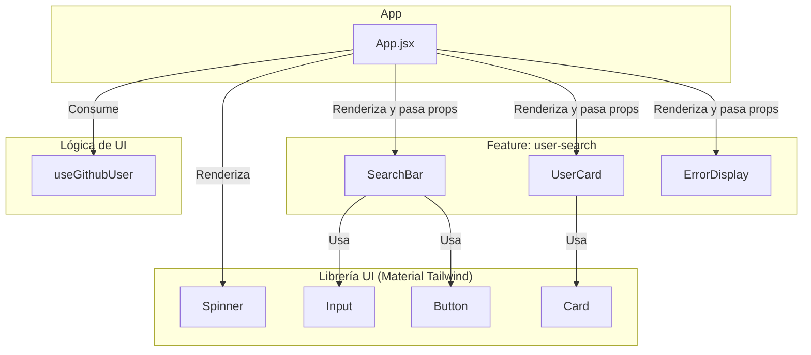

# Arquitectura y Diseño de Software

Este documento describe la arquitectura de alto nivel, los patrones de diseño y el flujo de datos de la aplicación "Visor de Perfiles de GitHub".

## 1. Filosofía Arquitectónica

La arquitectura del proyecto se adhiere a los siguientes principios clave:
-   **Separación de Conceptos (SoC)**: El código se organiza de manera que las diferentes responsabilidades (UI, estado, lógica de negocio, acceso a datos) estén lo más aisladas posible.
-   **Flujo de Datos Unidireccional**: Siguiendo el patrón estándar de React, los datos fluyen desde los componentes contenedores o hooks hacia los componentes de presentación, y los eventos fluyen en la dirección opuesta.
-   **Arquitectura basada en Features (Feature-Sliced Design)**: El código se agrupa por funcionalidad vertical en lugar de por tipo técnico horizontal. Esto significa que los componentes, hooks y estilos relacionados con una misma feature (ej. `user-search`) conviven en el mismo módulo, haciéndolos más cohesivos y reutilizables.

## 2. Arquitectura Lógica

La aplicación está estructurada en tres capas lógicas principales:

1.  **Capa de Vista (Componentes de React)**:
    -   **Responsabilidad**: Renderizar la interfaz de usuario basándose en el estado actual de la aplicación y capturar las interacciones del usuario.
    -   **Implementación**: Son componentes de React (`.jsx`). Se dividen en dos tipos:
        -   **Componentes Contenedores/Páginas (`App.jsx`)**: Orquestan la aplicación, consumen hooks y pasan datos y funciones a los componentes de presentación.
        -   **Componentes de Presentación (`UserCard`, `SearchBar`)**: Reciben datos a través de props y se centran exclusivamente en el "cómo se ven las cosas". No contienen lógica de negocio.

2.  **Capa de Lógica de UI (Hooks Personalizados)**:
    -   **Responsabilidad**: Encapsular la lógica de estado y los efectos secundarios de una feature. Actúa como un intermediario (Presenter o ViewModel) entre la vista y los servicios de datos.
    -   **Implementación**: Hooks personalizados de React (ej. `useGithubUser.js`). Son responsables de manejar el estado (`useState`), memorizar funciones (`useCallback`) y orquestar las llamadas a la capa de servicios.

3.  **Capa de Servicios**:
    -   **Responsabilidad**: Abstraer y gestionar la comunicación con fuentes de datos externas, como APIs REST.
    -   **Implementación**: Módulos de JavaScript simples (`services/github.js`). Exponen funciones asíncronas (ej. `fetchUser`) que ocultan los detalles de la implementación de `fetch`, manejo de errores HTTP y formateo de URLs.

## 3. Diagrama de Flujo de Datos del Proceso de Búsqueda

Este diagrama ilustra el flujo lógico completo, desde la interacción del usuario hasta la actualización de la UI.

```mermaid
graph TD
    subgraph "Capa de Vista (Componentes)"
        A[SearchBar] -->|1. Usuario escribe y pulsa 'Buscar'| B(Llama a `onSearch(username)`);
    end

    subgraph "Capa de Lógica de UI (Hooks)"
        C[useGithubUser]
        B -->|2. Se invoca `searchUser`| C;
        C -->|3. Pone `isLoading=true`, `error=null`| C;
        C -->|4. Llama al servicio| D[github.service];
    end
    
    subgraph "Capa de Servicios"
        D -->|5. Realiza `fetch` a la API de GitHub| E((api.github.com));
    end

    E -->|6. Devuelve datos o error| D;
    D -->|7. Retorna `Promise` resuelta o rechazada| C;
    
    subgraph "Actualización de Estado y UI"
        C -->|8a. Éxito: `setUser(data)`| F[Actualiza estado del hook];
        C -->|8b. Error: `setError(message)`| F;
        F -->|9. `isLoading=false`| F;
        F -->|10. React re-renderiza componentes| G[App.jsx];
        G -- error --> H[Renderiza ErrorDisplay];
        G -- user --> I[Renderiza UserCard];
    end
```

## 4. Diagrama de Componentes

Este diagrama muestra la relación jerárquica entre los componentes de React y cómo interactúan con los hooks y la librería de UI.



## 5. Representación y Manejo del Estado

El estado de la feature `user-search` está completamente encapsulado dentro del hook `useGithubUser`. Este enfoque se conoce como **estado co-localizado**.

```javascript
// Estructura del estado dentro de useGithubUser.js
{
  user: null | object,  // Almacena los datos del usuario si la búsqueda es exitosa.
  isLoading: boolean,   // `true` mientras se espera la respuesta de la API.
  error: null | string  // Almacena el mensaje de error si una petición falla.
}
```

**Ventajas de este enfoque:**
-   **Encapsulación:** Los componentes no necesitan saber cómo se gestiona el estado, solo lo consumen.
-   **Portabilidad:** Toda la lógica de la feature se puede mover o reutilizar fácilmente en otra parte de la aplicación.

Para el manejo de temas (claro/oscuro), se utiliza un enfoque diferente: **React Context** (`ThemeContext.jsx`). Esto se debe a que el tema es un **estado global** que necesita ser accesible por cualquier componente en cualquier nivel del árbol de la aplicación, sin tener que pasarlo a través de props.
