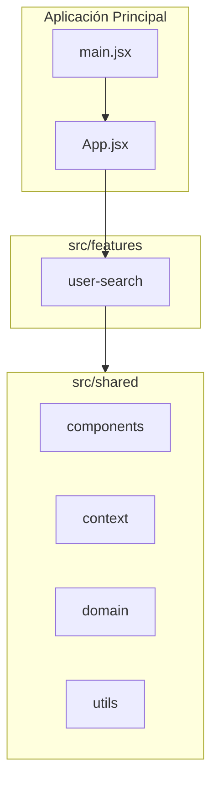
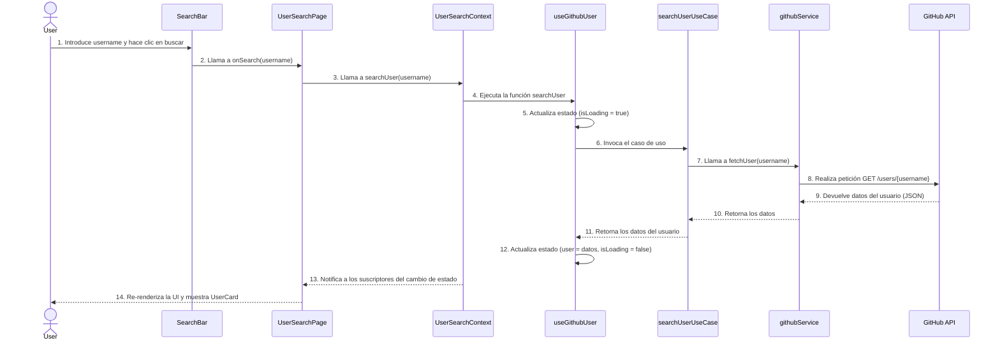
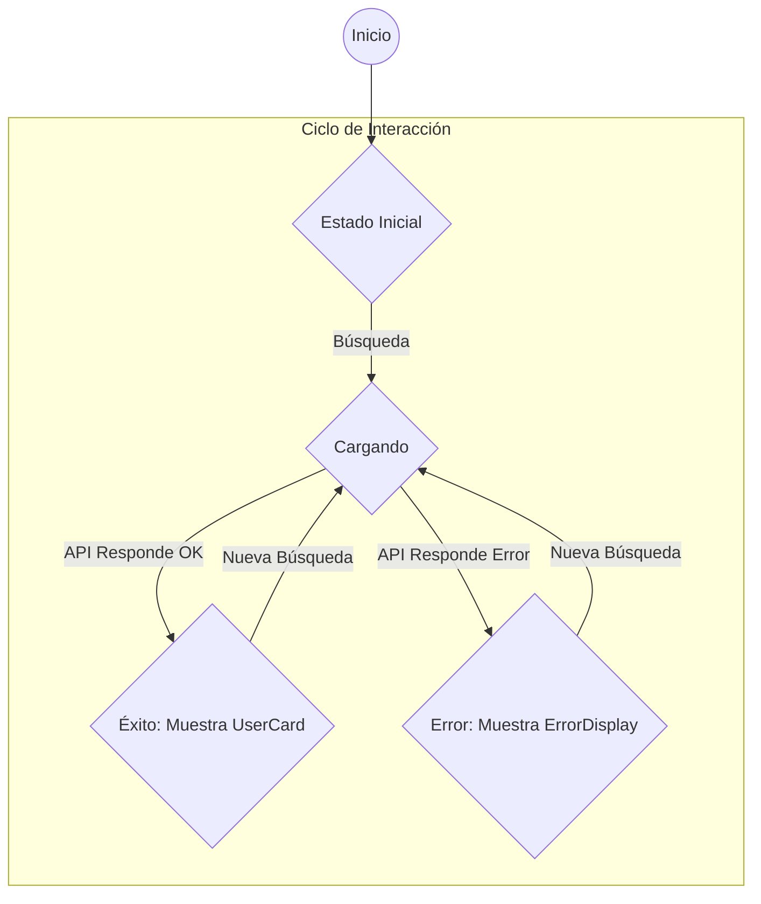
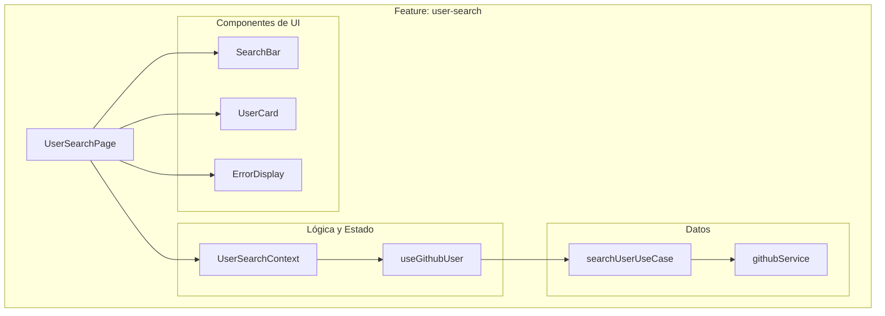

# 📐 Diagramas: GitHub Explorer

**Versión:** 1.0.0
**Fecha:** 17 de Enero, 2026

---

## 1. Propósito

Este documento contiene diagramas generados con Mermaid que ilustran la arquitectura, el flujo de datos y otros aspectos técnicos clave del proyecto **GitHub Explorer**.

---

## 2. Diagrama de Arquitectura del Software

Este diagrama muestra la **Arquitectura Basada en Features** del proyecto, con sus dos componentes principales: `features` y `shared`.

**Descripción:**
- La `App` principal monta la feature `user-search`.
- La feature `user-search` consume elementos reutilizables del directorio `shared`.

---

## 3. Diagrama de Flujo de Datos (Búsqueda de Usuario)

Este diagrama ilustra la secuencia de eventos y el flujo de datos cuando un usuario realiza una búsqueda.

---

## 4. Diagrama de Ciclo de Vida del Componente Principal

Este diagrama simplificado muestra el ciclo de vida de la página `UserSearchPage` y cómo responde a los cambios de estado del contexto.

---
## 5. Estructura de Componentes de la Feature

**Descripción:**
- La página `UserSearchPage` es el punto de entrada que consume el contexto y renderiza los componentes de UI según el estado.
- La lógica de estado está encapsulada en el hook `useGithubUser`, que es provisto a través de `UserSearchContext`.
- La lógica de negocio y el acceso a datos están aislados en el caso de uso y el servicio.
